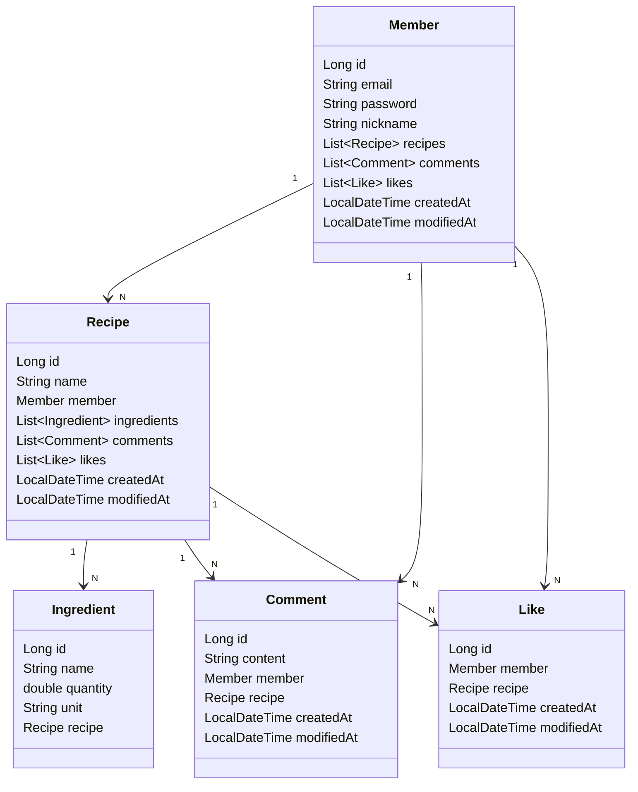

# Foodie Hub

> 요리 레시피 공유 커뮤니티

## 기술 스택

- Kotlin
- JDK 17
- Spring Boot 3.3.4
- Spring Boot JPA
- Spring Boot Validation
- H2, MySQL, JWT
- Gradle

## 구현 기능

- 회원
    - 회원 가입
    - 로그인 / 로그아웃
    - 회원 정보 조회
    - 회원 정보 수정
    - 작성 레시피 목록 조회
- 레시피
    - 레시피 작성
    - 레시피 수정
    - 레시피 삭제
    - 레시피 조회
    - 레시피 목록 조회
    - 레시피 검색
- 재료
    - 재료 추가
    - 재료 수정
    - 재료 삭제
    - 재료 검색
- 기타
    - 레시피 좋아요
    - 레시피 댓글

## ERD

