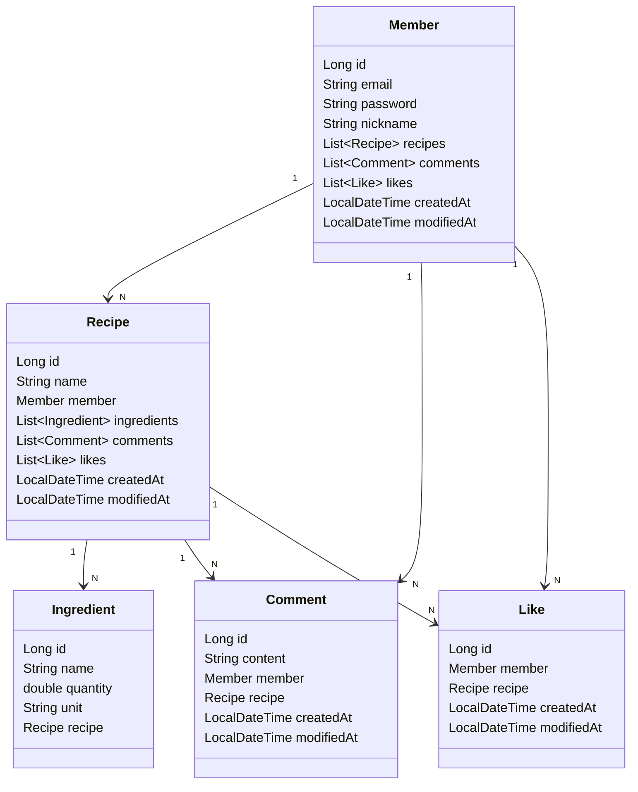

# Foodie Hub

> 요리 레시피 공유 커뮤니티

## 기술 스택

- Kotlin
- JDK 17
- Spring Boot 3.3.4
- Spring Boot JPA
- Spring Boot Validation
- H2, MySQL, JWT
- Gradle

## 구현 기능

- 회원
    - 회원 가입
    - 로그인 / 로그아웃
    - 회원 정보 조회
    - 회원 정보 수정
    - 작성 레시피 목록 조회
- 레시피
    - 레시피 작성
    - 레시피 수정
    - 레시피 삭제
    - 레시피 조회
    - 레시피 목록 조회
    - 레시피 검색
- 재료
    - 재료 추가
    - 재료 수정
    - 재료 삭제
    - 재료 검색
- 기타
    - 레시피 좋아요
    - 레시피 댓글

## ERD



## API 명세서

<details>
<summary>회원 API</summary>

#### 1. 회원 가입

- **URL**: `/api/members/signup`
- **Method**: `POST`
- **Request Body**:
  ```json
  {
    "email": "string",
    "password": "string",
    "nickname": "string"
  }
  ```
- **Response**:
    - `201 Created`: 회원 가입 성공

#### 2. 로그인

- **URL**: `/api/members/login`
- **Method**: `POST`
- **Request Body**:
  ```json
  {
    "email": "string",
    "password": "string"
  }
  ```
- **Response**:
    - `200 OK`: 로그인 성공
    - `401 Unauthorized`: 로그인 실패

#### 3. 로그아웃

- **URL**: `/api/members/logout`
- **Method**: `POST`
- **Response**:
    - `200 OK`: 로그아웃 성공

#### 4. 회원 정보 조회

- **URL**: `/api/members/{memberId}`
- **Method**: `GET`
- **Response**:
  ```json
  {
    "id": "long",
    "email": "string",
    "nickname": "string",
    "recipes": [
      {
        "id": "long",
        "name": "string"
      }
    ]
  }
  ```

#### 5. 회원 정보 수정

- **URL**: `/api/members/{memberId}`
- **Method**: `PUT`
- **Request Body**:
  ```json
  {
    "nickname": "string",
    "password": "string"
  }
  ```
- **Response**:
    - `200 OK`: 회원 정보 수정 성공

#### 6. 작성 레시피 목록 조회

- **URL**: `/api/members/{memberId}/recipes`
- **Method**: `GET`
- **Response**:
  ```json
  [
    {
      "id": "long",
      "name": "string",
      "createdAt": "datetime",
      "modifiedAt": "datetime"
    }
  ]
  ```

</details>

---

<details>
<summary>레시피 API</summary>

#### 1. 레시피 작성

- **URL**: `/api/recipes`
- **Method**: `POST`
- **Request Body**:
  ```json
  {
    "name": "string",
    "ingredients": [
      {
        "name": "string",
        "quantity": "double",
        "unit": "string"
      }
    ]
  }
  ```
- **Response**:
    - `201 Created`: 레시피 작성 성공

#### 2. 레시피 수정

- **URL**: `/api/recipes/{recipeId}`
- **Method**: `PUT`
- **Request Body**:
  ```json
  {
    "name": "string",
    "ingredients": [
      {
        "name": "string",
        "quantity": "double",
        "unit": "string"
      }
    ]
  }
  ```
- **Response**:
    - `200 OK`: 레시피 수정 성공

#### 3. 레시피 삭제

- **URL**: `/api/recipes/{recipeId}`
- **Method**: `DELETE`
- **Response**:
    - `204 No Content`: 레시피 삭제 성공

#### 4. 레시피 조회

- **URL**: `/api/recipes/{recipeId}`
- **Method**: `GET`
- **Response**:
  ```json
  {
    "id": "long",
    "name": "string",
    "member": {
      "id": "long",
      "nickname": "string"
    },
    "ingredients": [
      {
        "name": "string",
        "quantity": "double",
        "unit": "string"
      }
    ],
    "comments": [
      {
        "id": "long",
        "content": "string",
        "member": {
          "id": "long",
          "nickname": "string"
        }
      }
    ],
    "likes": "integer",
    "createdAt": "datetime",
    "modifiedAt": "datetime"
  }
  ```

#### 5. 레시피 목록 조회

- **URL**: `/api/recipes`
- **Method**: `GET`
- **Response**:
  ```json
  [
    {
      "id": "long",
      "name": "string",
      "member": {
        "id": "long",
        "nickname": "string"
      },
      "createdAt": "datetime",
      "modifiedAt": "datetime"
    }
  ]
  ```

#### 6. 레시피 검색

- **URL**: `/api/recipes/search`
- **Method**: `GET`
- **Query Parameters**:
    - `keyword`: `string`
- **Response**:
  ```json
  [
    {
      "id": "long",
      "name": "string",
      "member": {
        "id": "long",
        "nickname": "string"
      }
    }
  ]
  ```

</details>

---

<details>
<summary>재료 API</summary>

#### 1. 재료 추가

- **URL**: `/api/recipes/{recipeId}/ingredients`
- **Method**: `POST`
- **Request Body**:
  ```json
  {
    "name": "string",
    "quantity": "double",
    "unit": "string"
  }
  ```
- **Response**:
    - `201 Created`: 재료 추가 성공

#### 2. 재료 수정

- **URL**: `/api/recipes/{recipeId}/ingredients/{ingredientId}`
- **Method**: `PUT`
- **Request Body**:
  ```json
  {
    "name": "string",
    "quantity": "double",
    "unit": "string"
  }
  ```
- **Response**:
    - `200 OK`: 재료 수정 성공

#### 3. 재료 삭제

- **URL**: `/api/recipes/{recipeId}/ingredients/{ingredientId}`
- **Method**: `DELETE`
- **Response**:
    - `204 No Content`: 재료 삭제 성공

#### 4. 재료 검색

- **URL**: `/api/ingredients/search`
- **Method**: `GET`
- **Query Parameters**:
    - `name`: `string`
- **Response**:
  ```json
  [
    {
      "id": "long",
      "name": "string",
      "quantity": "double",
      "unit": "string"
    }
  ]
  ```

</details>

---

<details>
<summary>기타 API</summary>

#### 1. 레시피 좋아요

- **URL**: `/api/recipes/{recipeId}/likes`
- **Method**: `POST`
- **Response**:
    - `201 Created`: 좋아요 성공

#### 2. 레시피 댓글 작성

- **URL**: `/api/recipes/{recipeId}/comments`
- **Method**: `POST`
- **Request Body**:
  ```json
  {
    "content": "string"
  }
  ```
- **Response**:
    - `201 Created`: 댓글 작성 성공

#### 3. 레시피 댓글 조회

- **URL**: `/api/recipes/{recipeId}/comments`
- **Method**: `GET`
- **Response**:
  ```json
  [
    {
      "id": "long",
      "content": "string",
      "member": {
        "id": "long",
        "nickname": "string"
      }
    }
  ]
  ```

</details>

